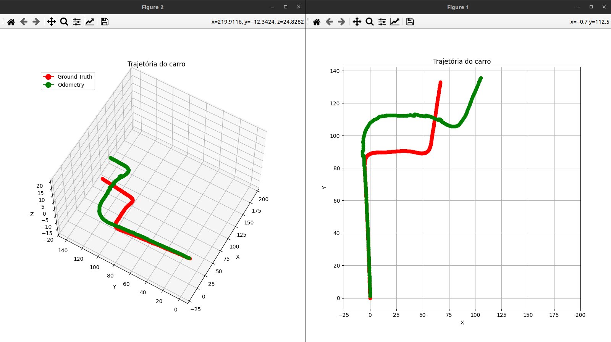
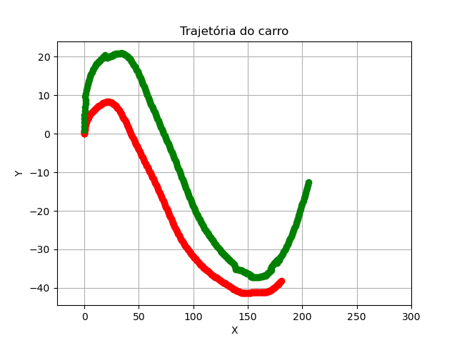
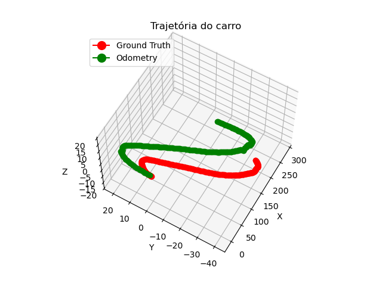
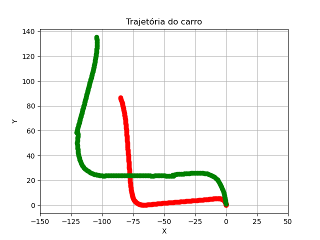
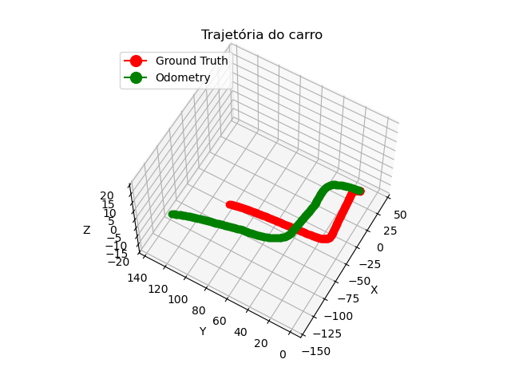

# Monocular Visual Odometry

**Author:** Lucas Reis das Chagas  
**Institution:** Institute of Informatics  
**University:** Federal University of Goiás  
**Location:** Goiânia, Brazil  
**Date:** January 10, 2025  

---

## Monocular Visual Odometry - Índice

- [Abstract](#abstract)
- [I. Introduction](#i-introduction)
- [II. Fundamental Concepts](#ii-fundamental-concepts)
  - [A. Point Correspondence](#a-point-correspondence)
  - [B. Fundamental Matrix](#b-fundamental-matrix)
  - [C. RANSAC](#c-ransac)
  - [D. Essential Matrix](#d-essential-matrix)
  - [E. Triangulation](#e-triangulation)
- [III. Methodology](#iii-methodology)
- [IV. Experiments and Results](#iv-experiments-and-results)
  - [Results: Dataset 1](#results-dataset-1)
  - [Results: Dataset 2](#results-dataset-2)
  - [Results: Dataset 3](#results-dataset-3)
- [Conclusion](#conclusion)
- [Referências](#referências)

## Abstract

Monocular visual odometry is a widely used technique in robotics that estimates the position and orientation of a camera over time using consecutive frames captured by a monocular camera and its intrinsic parameter matrix. Since the process is prone to errors, primarily due to using 2D coordinates to estimate 3D coordinates, this work adopts the conventional monocular visual odometry pipeline to address challenges like scale ambiguity, occlusion effects, and correspondence errors. Additionally, we present ideas to reduce accumulated errors over time.

**FOR FULL CONTENT, [READ THE ARTICLE](./Odometria_Visual_Monocular.pdf)**
---

## I. Introduction
This package only presents a summary and result of the project, the article commented previously explains the concepts in detail.

Monocular visual odometry is a field studied in robotics and computer vision, aiming to extract motion and orientation information from image sequences obtained from a single camera.

Some advantages of using a camera for odometry include its applicability in both indoor and outdoor environments and its low cost, as motion can be derived using only one camera. However, the technique's core challenge lies in estimating 3D motion from 2D data, as depth information cannot be accurately obtained without additional knowledge.

This package comments on the conventional monocular visual odometry pipeline discussed in the paper. Section II discusses fundamental concepts, Section III details the employed methodology, and Sections IV and V present results and conclusions.

---

## II. Fundamental Concepts

This chapter is divided into subsections to segment the content. The following table outlines the topics covered:

| Index | Topic                   |
|-------|-------------------------|
| A     | Point Correspondence    |
| B     | Fundamental Matrix      |
| C     | RANSAC                  |
| D     | Essential Matrix        |
| E     | Triangulation           |

---

### A. Point Correspondence

To estimate the rotation and translation between two frames, it is essential first to identify corresponding points in the two images. Key features must be extracted to be invariant to rotation and scale, robust to illumination changes, etc. Methods such as SIFT, SURF, ORB, and KLT are commonly used.

In this work, the SIFT (Scale-Invariant Feature Transform) algorithm is used, involving two stages:  
1. **Detectors**: Identifying characteristic points using Gaussian differences and pyramids to find scale-invariant points.  
2. **Descriptors**: Creating descriptors for each detector by normalizing gradient magnitudes and orientations in a local window.

---

### B. Fundamental Matrix

The fundamental matrix (F) describes the geometric relationship between two views of the same scene. It relates corresponding points and defines an epipolar line \( l' \):

$$
l' = [\mathbf{e}]_{\times} \mathbf{Hx} = \mathbf{Fx}
$$

Where **F** satisfies:

$$
\mathbf{x}'^T \mathbf{F} \mathbf{x} = 0
$$

---

### C. RANSAC

RANSAC (Random Sample Consensus) is an iterative method to estimate the best mathematical model by selecting random subsets of points. It is used to identify inliers and generate a robust fundamental matrix.

---

### D. Essential Matrix

The essential matrix is derived using the camera's intrinsic parameters and establishes the relationship between 3D world points and their 2D projections.

$$
\mathbf{E} = \mathbf{k}'^T \mathbf{F} \mathbf{k}
$$
---

### E. Triangulation

Triangulation reconstructs 3D points from corresponding 2D image points, considering the relative pose between frames.

---

## III. Methodology

Initially, we define the initial position and orientation along with the coordinate system. Since this work is based on the KITTI datasets, which do not provide a specific point of interest to define the initial coordinate system, the first frame's position and orientation were chosen as the origin.

Once the initial point is established, the goal is to determine the motion (rotation and translation) between consecutive frames using the concepts explained in Section II. The state vector was defined to store position and orientation over time as follows:

$$ 
X_{\text{state}} =
\begin{bmatrix}
0 & \text{tx} \\
0 & \text{ty} \\
0 & \text{tz} \\
0 & \theta_x \\
0 & \theta_y \\
0 & \theta_z \\
\end{bmatrix}_{6 \times 1}
$$

The first frame is processed to extract keypoints and descriptors (e.g., using SIFT). The second frame is required for further processing since a single frame does not provide enough data for accurate estimation. Once descriptors are extracted from the second frame, keypoints are matched using techniques such as KNN. This ensures that corresponding points between the two frames are identified.

With the matched points, the RANSAC algorithm is employed to estimate the fundamental matrix while rejecting outliers and dynamic points in the scene. Using the fundamental matrix, the essential matrix is calculated, assuming identical intrinsic parameters for the camera. Decomposing the essential matrix using SVD provides four potential rotation-translation combinations. The correct combination is chosen based on the condition that projected 3D points lie in front of the camera.

Using the selected rotation and translation matrices, projection matrices **P** and **P** are derived for the first and second frames. Triangulation is then performed to compute 3D points **Q_1** and **Q_2**. The combination with the highest count of positive-depth 3D points is selected.

Since monocular visual odometry does not provide absolute scale, a relative scale is estimated using the following equation:

$$
\text{Relative Scale} = \frac{1}{N} \sum_{i=1}^{N} \frac{\| Q1_{i} - Q1_{i+1} \|}{\| Q2_{i} - Q2_{i+1} \|}
$$

The final step involves updating the state vector with rotation (converted to Euler angles) and translation. Keypoints and descriptors of the last frame are retained for matching with subsequent frames.

---

## IV. Experiments and Results

To evaluate the approach, a Python script was developed and tested with the KITTI dataset. Metrics were computed to compare visual odometry positions against KITTI-provided ground truth for the first 250 poses of selected datasets. The following metrics were used:

| Symbol | Metric                         |
|--------|--------------------------------|
| AE     | Average Error                  |
| RMSE   | Root Mean Square Error         |
| RTE    | Relative Trajectory Error      |
| ME     | Maximum Error                  |
| RV     | Relative Variation             |

### Results: Dataset 1

| Metric      | X (m)     | Y (m)     | Z (m)     |
|-------------|-----------|-----------|-----------|
| AE          | 15.999529 | 12.336455 | 3.966199  |
| RMSE        | 22.996220 | 14.602512 | 4.358621  |
| RTE         | 15.602974 | 12.261463 | 4.035954  |
| ME          | 48.950199 | 26.627214 | 6.371521  |
| RV          | 1.585224  | 0.817951  | 0.323359  |

### Results: Dataset 2

  

| Metric          | X (m)      | Y (m)      | Z (m)      |
|-----------------|------------|------------|------------|
| AE              | 15.633919  | 8.792058   | 7.623112   |
| RMSE            | 16.671636  | 10.118853  | 9.513446   |
| RTE             | 15.746078  | 8.598048   | 7.768917   |
| ME              | 24.703141  | 25.488619  | 16.093915  |
| RV              | 1.166949   | 2.489913   | 1.287053   |

### Results: Dataset 3

  

| Métric          | x          | y          | z          |
|-----------------|------------|------------|------------|
| AE              | 27.130710  | 28.761960  | 4.935562   |
| RMSE            | 29.639156  | 30.917911  | 6.002114   |
| RTE             | 27.835642  | 28.845624  | 4.876406   |
| ME              | 43.547963  | 48.562704  | 13.337184  |
| RV              | 0.736236   | 1.555818   | 17.945104  |
---

## Conclusion

The proposed monocular visual odometry method successfully estimated trajectories using KITTI datasets. Metrics demonstrate robustness and accuracy within acceptable error ranges, despite challenges posed by monocular setups, such as scale ambiguity.

## Referências

1. R. Hartley and A. Zisserman, *Multiple View Geometry in Computer Vision*. Cambridge University Press, March 2004.

2. R. Szeliski, *Computer Vision: Algorithms and Applications*, 2ª ed. Springer, 2022.

3. M. C. dos Santos, *Revisão de Conceitos em Projeção, Homografia, Calibração de Câmera, Geometria Epipolar, Mapas de Profundidade e Varredura de Planos*. UNICAMP, Campinas, Outono/Inverno de 2012.

4. H. M. Gräbin, *Odometria Visual Monocular: Estudo de caso para veículos terrestres*. Universidade Federal do Rio Grande do Sul, Escola de Engenharia, Departamento de Engenharia Elétrica, Porto Alegre, 2019.

5. N. Nicolai, *Visual Odometry with Monocular Camera For Beginners: A Project in OpenCV*. YouTube, March 2022. Available at: [https://www.youtube.com/watch?v=N451VeA8XRA&list=PL0aGtEdJ77pxr7MFFEUT4oOOatuZ9Upeo&index=37&t=743s](https://www.youtube.com/watch?v=N451VeA8XRA&list=PL0aGtEdJ77pxr7MFFEUT4oOOatuZ9Upeo&index=37&t=743s).

6. Anonymous, *SIFT (Scale Invariant Feature Transform)*. Pontifical Catholic University in Rio de Janeiro (PUC-Rio), accessed in 2024.

7. A. Geiger, P. Lenz, C. Stiller, and R. Urtasun, "KITTI Odometry Dataset," [Online]. Available at: [https://www.cvlibs.net/datasets/kitti/eval_odometry.php](https://www.cvlibs.net/datasets/kitti/eval_odometry.php).
